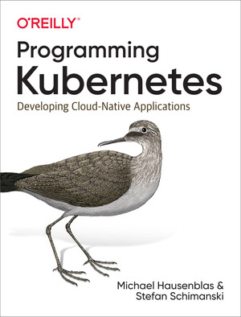

# Stefan Schimanski 👋

I build software: developer tools, distributed systems, experiments, side projects, and the occasional weird machine.

Publicly, that currently looks like:
- 100+ original repositories
- 2,800+ merged PRs in external open source
- major long-term contribution history in [Kubernetes](https://github.com/kubernetes/kubernetes), [kcp](https://github.com/kcp-dev/kcp), and [OpenShift](https://github.com/openshift)

## Projects

- 🧠 [nanoschnack](https://github.com/nanoschnack/nanoschnack) — language model training and tokenizer work — Python, Go
- 🕸️ [kausality](https://github.com/kausality-io/kausality) — causal traceability for Kubernetes resource mutations — Go — [📺](https://www.youtube.com/watch?v=kfqKqXnRKms)
- 🔗 [kube-bind](https://github.com/kubebind/kube-bind) — inventor of kube-bind for binding services between Kubernetes clusters — Go
- 🌐 [multicluster-runtime](https://github.com/multicluster-runtime/multicluster-runtime) — invented and bootstrapped multicluster-runtime for multi-cluster controller-runtime controllers — Go
- 🤖 [slagent](https://github.com/sttts/slagent) — Claude talking to Slack — Go
- ☸️ [kc](https://github.com/sttts/kc) — Kubernetes Commander — Go
- 🌐 [kubectl-http](https://github.com/sttts/kubectl-http) — HTTPie as a kubectl plugin — Shell
- 🕹️ [claw64](https://github.com/sttts/claw64) — an [OpenClaw](https://github.com/openclaw/openclaw)-inspired Claw for the Commodore 64 — Go
- 🧩 [xf-cli](https://github.com/sttts/xf-cli) — XenForo CLI and MCP tooling — Go
- 🧪 [shell-ai-widget](https://github.com/sttts/shell-ai-widget) — AI-powered inline shell command editing — Go
- 🏠 [ha-git-backup](https://github.com/sttts/ha-git-backup) — Git-backed backup add-on for Home Assistant — Shell
- 🎮 [kbounce](https://github.com/sttts/kbounce) — Godot recreation of KBounce — GDScript
- ⚡ [godot-quickjs](https://github.com/sttts/godot-quickjs) — QuickJS embedded into Godot 4 — C++
- 🔧 [crd-gates](https://github.com/sttts/crd-gates) — feature gates for CRDs — Go
- 🧱 [blender-wrl](https://github.com/sttts/blender-wrl) — Blender plugin for importing WRL files — Python
- 📚 [tvniki](https://github.com/sttts/tvniki) — a revived programming learning system from 1996 — Pascal

## Open Source

A lot of my work happens upstream rather than only in personal repos.

- ☸️ [Kubernetes](https://github.com/kubernetes/kubernetes) — 620 merged PRs across core code and API machinery, including co-authoring CRDs and [Watch List](https://github.com/kubernetes/enhancements/blob/master/keps/sig-api-machinery/3157-watch-list/README.md), crucial for large AI clusters — Go
- 🧩 [kcp](https://github.com/kcp-dev/kcp) — 366 merged PRs across the kcp ecosystem, architectural lead during the Red Hat era, still project advisor, and helped get it into CNCF Sandbox — Go
- 🔴 [OpenShift](https://github.com/openshift) — 745 merged PRs across the OpenShift org, including many years as control plane lead — Go
- 🌍 contributions across [Crossplane](https://github.com/crossplane/crossplane) and related projects — Go

## Book

- [Programming Kubernetes](https://www.oreilly.com/library/view/programming-kubernetes/9781492047094/) — co-authored with Michael Hausenblas — O'Reilly, 2019

## KubeCon Talks

All talks: [YouTube](https://www.youtube.com/playlist?list=PL10Tb4xgNVrzhCqlGuWfn3Oqma0e_b5KJ)

- 2026: [SIG API Machinery: SIG Updates and Deep Dive in the AI/ML Era - Stefan Schimanski, NVIDIA](https://www.youtube.com/watch?v=Or19H4ExOPE)
- 2025: [The Life (or Death) of a Kubernetes API Request, 2025 Edition - Abu Kashem & Stefan Schimanski](https://www.youtube.com/watch?v=Hc0jj-654lA)
- 2025: [Dynamic Multi-Cluster Controllers With Controller-runtime - Marvin Beckers & Stefan Schimanski](https://www.youtube.com/watch?v=Tz8IcMSY7jw)
- 2024: [The Missing Talk About API Versioning & Evolution in Your Developer Pl... S. Schimanski, S. Urbaniak](https://www.youtube.com/watch?v=pHRQpqCEvU8)
- 2024: [Deep Dive Into Generic Control Planes and Kcp - Stefan Schimanski & Mangirdas Judeikis](https://www.youtube.com/watch?v=R9YUOo0MwqY)
- 2024: [Shift-Left: Past, Present, and Future of Validation in CI... Alexander Zielenski & Stefan Schimanski](https://www.youtube.com/watch?v=KaXIq8Qv77A)
- 2024: [Why Kubernetes Is Inappropriate for Platforms, and How to Make It Better](https://www.youtube.com/watch?v=7op_r9R0fCo)
- 2023: [API Machinery Dual Maintainer Track - Federico Bongiovanni & Leila Jalali & Stefan Schimanski](https://www.youtube.com/watch?v=AfjYrxTiOac)
- 2022: [Kcp: Towards 1,000,000 Clusters, Name^WWorkspaced CRDs - Stefan Schimanski, Red Hat](https://www.youtube.com/watch?v=fGv5dpQ8X5I)
- 2021: [SIG API Machinery Deep Dive - App... Abu Kashem & Stefan Schimanski, Joe Betz & Federico Bongiovanni](https://www.youtube.com/watch?v=oiC2w1PVjrQ)
- 2020: [Into the Deep Waters of API Machinery - Federico Bongiovanni & Daniel Smith, Google, & David Eads](https://www.youtube.com/watch?v=0VWNWJktcHk)
- 2019: [Tutorial: Mastering Multi-version CRDs: From YAML to a Serious Devel... Stefan Schimanski & Joe Betz](https://www.youtube.com/watch?v=AAxuEPIzHUQ)
- 2019: [Deep Dive Into API Machinery - Antoine Pelisse, Google & Stefan Schimanski, Red Hat](https://www.youtube.com/watch?v=qTm-g3vtVOE)
- 2019: [OpenAPI Specs – Towards Native User Experience of CRDs - Stefan Schimanski, Red Hat](https://www.youtube.com/watch?v=fatglKZYdSQ)
- 2018: [Kubernetes Contributor Summit 2018 - API Codebase Tour](https://www.youtube.com/watch?v=e9Wnhoh0Fy0)
- 2018: [Deep Dive: API Machinery SIG - Stefan Schimanski, Red Hat & Daniel Smith, Google](https://www.youtube.com/watch?v=kz8BMn9_hk8)
- 2018: [Audit in Kubernetes, the Future is Here - Stefan Schimanski & Maciej Szulik, Red Hat](https://www.youtube.com/watch?v=Up1qgVIzoVM)
- 2018: [The Future of Your CRDs – Evolving an API - Stefan Schimanski, Red Hat & Mehdy Bohlool, Google](https://www.youtube.com/watch?v=HsYtMvvzDyI)

## Other Talks

- 2026: [Building a GPT-2 Model from Scratch by Stefan Schminanski](https://www.youtube.com/watch?v=pelJrIzrP3Y)
- 2025: [Dynamic Multi-Cluster Controllers with controller-runtime - Marvin Beckers & Stefan Schimanski](https://www.youtube.com/watch?v=B4vxcCJjffk)
- 2023: [The future of CRDs in a post-cluster world - Sebastian Scheele & Stefan Schimanski](https://www.youtube.com/watch?v=XGnSZQLFJpA)
- 2022: [Panel: The Future of Kubernetes is Control Planes - Red Hat OpenShift Commons 2022 Detroit](https://www.youtube.com/watch?v=1p00SMLletY)
- 2022: [What if namespaces provided more isolation than just names?](https://www.youtube.com/watch?v=WGrPUyx7qQE)
- 2018: [Code Base Tour: github.com/kubernetes/kubernetes](https://www.youtube.com/watch?v=yqB_le-N6EE)
- 2018: [Extending Kubernetes with CustomResouceDefinition - Dr. Stefan Schimanski, Red Hat](https://www.youtube.com/watch?v=Ne4jQF-CPIM)
- 2018: [Stefan Schimanski about Kubernetes as a API driven platform, Reykjavík Kubernetes Meetup](https://www.youtube.com/watch?v=BiE7oKeEzDU)
- 2016: [Elastic etcd – automatic add, replace and cluster growth](https://www.youtube.com/watch?v=wpgoxWIbGRs)

## Legacy

Older projects and ecosystems that still represent what I build:

- 🐧 [KDE](https://kde.org/) — core contributor, with heritage including KBounce, KMixer, browser plugins, and more — C++, Qt
- ⚙️ [elastic-etcd](https://github.com/sttts/elastic-etcd) — elastic discovery wrapper around etcd — Go
- 🐳 [kubernetes-dind-cluster](https://github.com/sttts/kubernetes-dind-cluster) — early Docker-in-Docker Kubernetes dev clusters, an ancestor of kind — Shell
- 🏗️ [compute-platform](https://github.com/sttts/compute-platform) — Mesos-based compute platform — Shell
- 🚀 [kubernetes-mesos](https://github.com/kubernetes-retired/kubernetes-mesos) — Kubernetes on Apache Mesos — Go
- 🏃 [Marathon](https://github.com/d2iq-archive/marathon) — container orchestration on Apache Mesos — Scala
- 🛰️ [mesos-dns](https://github.com/mesosphere/mesos-dns) — DNS-based service discovery for Mesos — Go
- 📧 [ldap-notify](https://github.com/sttts/ldap-notify) — LDAP password and login expiration notifications — Python
- 🗺️ [google-maps-mock](https://github.com/sttts/google-maps-mock) — Google Maps JS mocking for tests — JavaScript

## Elsewhere

- [@the_sttts on X](https://twitter.com/the_sttts)
- [@sttts.social on Bluesky](https://bsky.app/profile/sttts.social)
